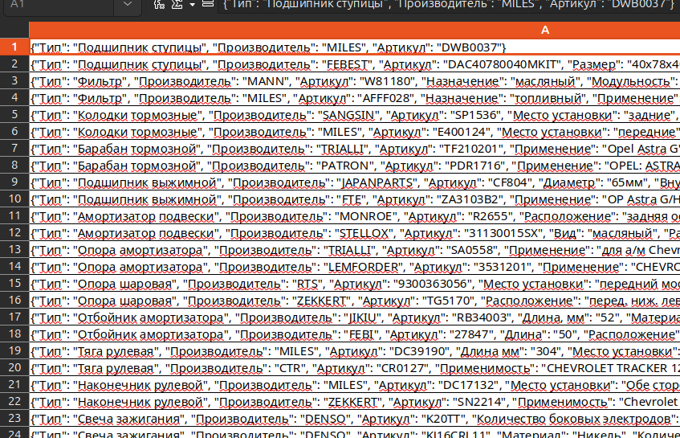
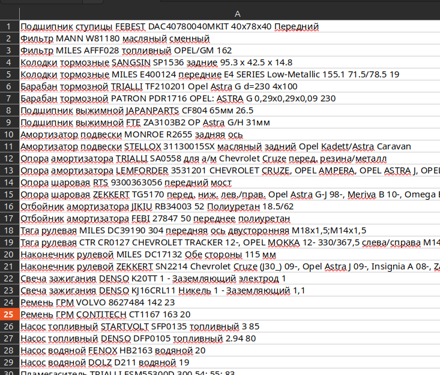

Нормализация текста по заданной схеме.

Схема - Должна иметь уникальный тип и набор атрибутов

Пример - Должен иметь тип, ненормализованный текст и нормализованный атрибут

Установка uv:
windows:
```powershell
powershell -ExecutionPolicy ByPass -c "irm https://astral.sh/uv/install.ps1 | iex"
```
linux:
```bash
curl -LsSf https://astral.sh/uv/install.sh | sh
```
any:
```bash
pip install uv
```

Запуск приложения: 
```bash
uv run main.py
```

По умолчанию используется Ollama в качестве сервера.
```bash
ollama serve
ollama pull paraphrase-multilingual:latest
ollama pull qwen3:30b-a3b-q4_K_M
```

Конфигурация меняется в .env файле

Схемы и примеры могут быть загружены из xlsx файла:


Если в таблице несколько типов или есть существующие для схемы, то они пропустятся (возьмется только 1 если несколько типов одинаковых.)

Нормализация может происходить с помощью xlsx файла.


Вернется xlsx файл с нормализованными данными по существующим схемам и примерам.
